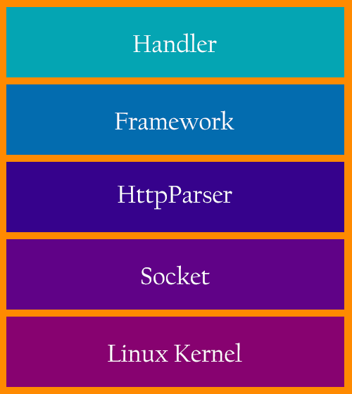
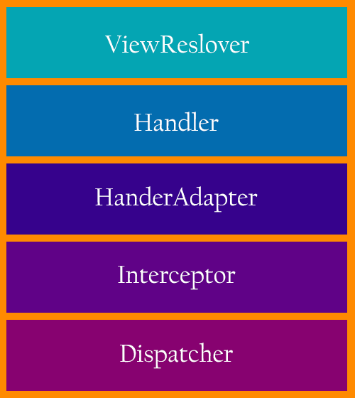

# 在Android上像SpringMVC一样做Web开发

一部分Android开发者看到这个标题时可能有点疑惑，SpringMVC不是用来做JavaWeb开发的吗？难道被移植到Android上来了？答案是否定的，因为SpringMVC是基于Servlet的，在Android上开发一个支持Servlet的容器（Tomcat、JBoss）可不简单，所以我们是在Android上开发了一套全新的WebServer + WebFramework。

AndServer2.0基于编译时注解实现了SpringMVC的大部分注解Api，其Request的分发流程也基本和SpringMVC一致，与SpringMVC最大的不同是SpringMVC基于运行时注解，并且SpringMVC提供的功能更多更强大。不过AndServer提供的功能在Android上来做服务端开发是完全足够的。

看到这里读者朋友应该知道了，AndServer2.0是使用注解开发Web程序的，为了有个更直观的了解，我们先看一个模拟用户登录的Http Api：
```java
@RestController
public class UserController {

    @PostMapping("/login")
    public String login(@RequestParam("account") String account,
        @RequestParam("password") String password) {

        if(...) {
            return "Successful";
        }
        return "Failed";
    }
}
```

假设服务端的Address是`192.168.1.11`，监听的端口是`8080`，那么通过`http://192.168.1.11:8080/login`就可以访问该登录Http Api了。

感兴趣的读者可以帮我们做一下Code Review：  
[https://github.com/yanzhenjie/AndServer](https://github.com/yanzhenjie/AndServer)  

下文将依次介绍以下三点：  
1. 系统层架构蓝图
2. 应用层架构蓝图
3. 使用示例

## 1. 系统层架构蓝图
我们都知道Http是根据Http协议使用Socket做了连接属性、数据格式、交互逻辑方面的包装，我们来**模拟**一段服务端启动Server的代码：
```java
public void startServer(String address, int port) {
    InetAddress inetAddress = InetAddress.getByName();
    ServerSocket serverSocket = new ServerSocket(8080, 512, inetAddress);
    while (true) {
        Socket socket = serverSocket.accept();

        HttpConnection connection = HttpParser.parse(socket);
        HttpThead thread = new HttpThread(connection);
        thread.start();
    }
}
```

`ServerSocket`监听了某个端口，当有`Socket`连接上来的时候去把这个`Socket`解析为`HttpConnection`，可想而知，作为服务端程序，`HttpConnection`至少包涵了`Request`和`Response`对象：
```java
public class HttpConnection {
    private Request mRequest;
    private Response mResponse;

    ...
}
```

紧接着启动了一个线程去处理这个`Request`，怎么处理这个`Request`是一个WebFramework的核心，假设我们有一个类叫做`HttpDispatcher`，负责派发请求到Html File或者Java Method处理：
```java
public class HttpDispatcher {

    public void dispath(Request request, Response response) {
        ...
    }

}
```

`HttpThead`只需要负责调用`HttpDispatcher#diaptch()`即可，到这里就比较清晰了，只需要`HttpDispatcher`把当前`Request`派发到对应的Html File或者Java Method处理就可以了。

这就是一个简单的WebServer的蓝图，我们根据设想画出了系统层架构图：



系统层运行时流程图：


上图中，`Handler`表示处理请求的操作手柄，可能是Html File或者Java Method。值得高兴的一点是，在我们迭代了几个版本后，发现Apache组织提供了上述蓝图中的`HttpParser`层，因此为了稳定性和节省人力我们已经替换该层为Apache的实现。

## 2. 应用层架构蓝图
应用层就是上文中提到的WebFramework的核心，也就是上一个小节流程图的`Framework`层，包括了Session的处理、Cookie的处理、Cache的处理等。

接着上文，`HttpDispatcher`需要把当前`Request`派发到对应的Html File或者Java Method处理，而`Handler`代表了Html File或者Java Method，那么因为此二者区别极大，因此我们想到了使用`Adapter`模式，所以有了一个抽象类`RequestHandler`：
```java
public abstract class RequestHandler {

    public abstract void handle(Request request, Response response);
}
```

所以必须得有一个`HandlerAdapter`去做`Handler`适配：
```java
public class HandlerAdapter {

    public RequestHandler getHandler(Request request) {
        ...
    }
}
```

因为Html File和Java Method的返回值又是大相径庭，因为返回值是输出到客户端展示的，所以我们把返回值抽象为`View`：
```java
public class View {

    public Object output() {
        ...
    }
}
```

因为`View`是返回值，没有具体的交互了，所以不适用`Adapter`模式了，因此我们必须有一个处理返回值的机制，把处理返回值的机制叫做`ViewResolver`：
```java
public class ViewResolver {

    public void resolver(View view, Request request, Response response) {
        ...
    }
}
```

这就是一个简单的WebFramework的蓝图，我们根据设想画出了应用层架构图：



应用层运行时流程图：


上图中，`Interceptor`表示拦截请求的拦截器，比如可以做一些不允许没登录或者没权限的请求进入的工作。`ExceptionResolver`表示全局异常处理器，比如某个Api发生了异常，会转到`ExceptionResolver`中处理，而不至于当前请求不响应或者响应了不想被客户端看到的消息。

> 另外需要补充的是，上文中提到的都是粗略的设计，中间还有一些细节，例如Session的处理、Cookie的处理、缓存的处理等都未提到，其中任何一个知识点单独拿出来都可以写一篇文章，由于篇幅关系这里不做详细介绍。

架构设计和流程到此就都介绍完了，有兴趣的开发者也可以自己实现一下，下面我们将简单介绍一下AndServer的使用。

## 3. 使用示例
AndServer对于方便使用的理念是：只需要添加注解即可，不需要再做额外的配置。所以除了像文章开头那样用注解写好Api之外，只需要指定监听端口启动服务器就可以了。

> 与读者做个约定，下文中服务器Address都是`192.168.1.11`，监听的端口是`8080`。

### 3.1. 网站部署示例
我们先来部署一个位于Assets中`/web`下的网站：
```java
@Website
public class InternalWebsite extends AssetsWebsite {

    public InternalWebsite() {
        super("/web");
    }
}
```

因此SD的文件可以删除也可以增加，想做到热插拔，就署位于SD卡的网站：
```java
@Website
public class InternalWebsite extends StorageWebsite {

    public InternalWebsite() {
        super("/sdcard/AndServer/web");
    }
}
```

如上所示，开发者只需要将网站所在的路径告诉`AndServer`，并添加`Website`注解即可，该网站的Html、CSS、JS、其它文件都可以被访问，例如`/web`目录下有一个`index.html`文件，那么访问地址就是`http://192.168.1.11:8080/`或者`http://192.168.1.11:8080/index.html`。

### 3.2. Http Api开发示例
在文章开头我们看了一个模拟用户的Http Api，下面我们增加一个模拟获取用户信息的Api：
```java
@RequestMapping("/user")
@RestController
public class UserController {

    @PostMapping("/login")
    public String login(@RequestParam("account") String account,
        @RequestParam("password") String password) {

        if(...) {
            return "Successful";
        }
        return "Failed";
    }

    @GetMapping("/info/{userId}")
    public User info(@PathVariable("userId") String userId) {
        User user = ...;
        return user;
    }
}
```

于是我们得到两个地址：
```text
POST http://192.168.1.11:8080/user/login
GET  http://192.168.1.11:8080/user/info/uid_001
```

### 3.3. 启动服务器
```java
AndServer.serverBuilder()
    .inetAddress(NetUtils.getLocalIPAddress())
    .port(8080)
    .timeout(10, TimeUnit.SECONDS)
    .build()
    .start();
```

如上所示只需要指定要监听的服务端地址和端口，启动服务器即可。

本人到此就结束，由于篇幅关系，介绍的比较粗略，有兴趣的开发者可以看看项目使用文档：  
[https://www.yanzhenjie.com/AndServer](https://www.yanzhenjie.com/AndServer)